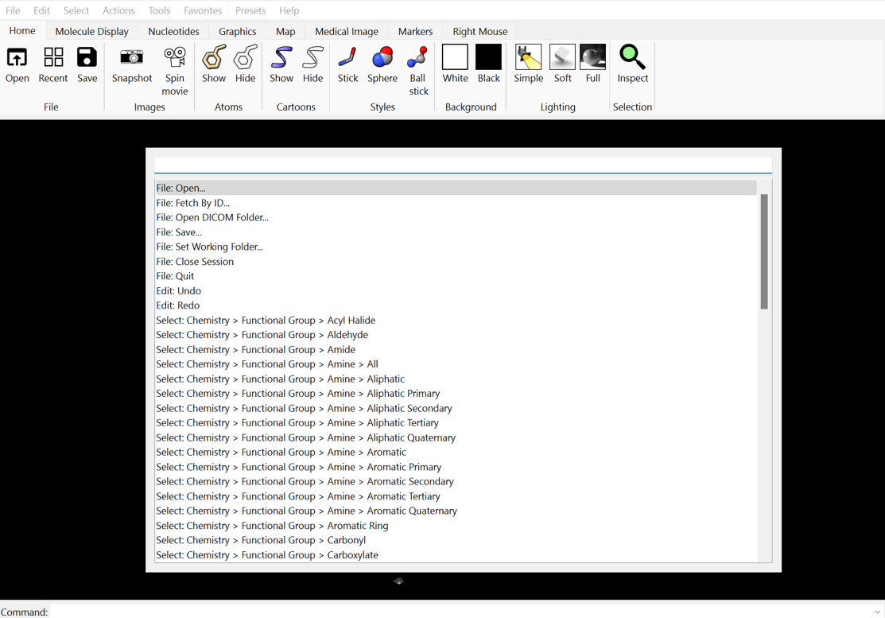

# ChimeraX-command-palette



A command palette widget for ChimeraX.

This widget adds all the actions in the menubar and tabbar.

## How to use

1. Install `ChimeraX-command-palette`.
   1. From toolshed ... This plugin is available [here](https://cxtoolshed.rbvi.ucsf.edu/apps/chimeraxcommandpalette).
   2. From source
      Clone this repository
      ```shell
      git clone git+https://github.com/hanjinliu/ChimeraX-command-palette
      ```

      and install using ChimeraX command line interface

      ```shell
      devel install "path/to/ChimeraX-command-palette"
      ```

2. Register command palette to any of the function keys. For example, you can assign "F2" key to open a command palette by running following command in the ChimeraX command line interface.
    ```shell
    fun F2 "command palette"
    ```

## Issues/Requests

If you find a bug, or have some feature requests, feel free to open an issue in this 
GitHub repository, or contact me via [X/Twitter](https://twitter.com/liu_hanjin).
